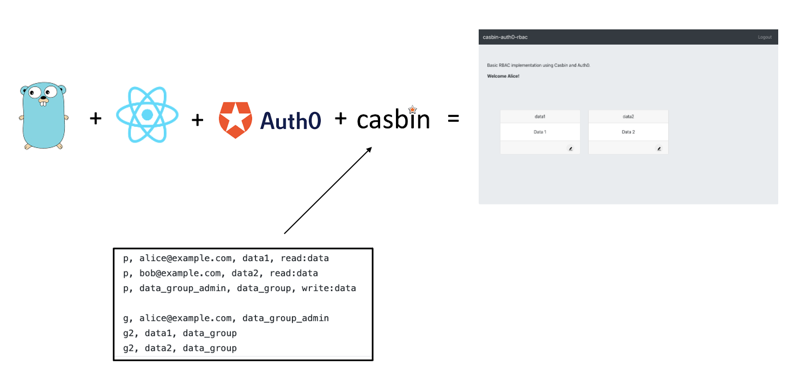
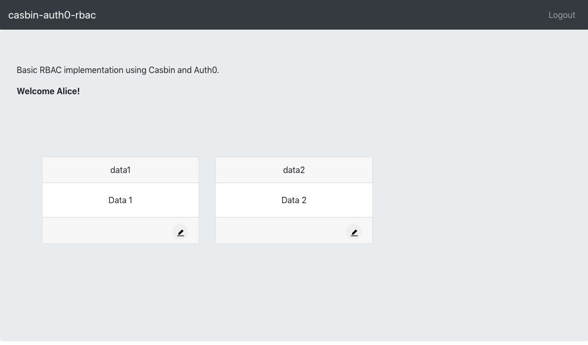

# casbin-auth0-rbac
Example RBAC authorization with Casbin and Auth0.

<p  align="center">
    
</p>

Login as Alice, she has write access to data1 and data2:
<p  align="center">
    
</p>


## Setup
1. create auth0 account
2. create app
<p  align="center">
    
</p>

3. update app settings to set Allowed Callback URLs and Allowed Logout URLs and Allowed Web Origins to http://localhost:3000
<p  align="center">
    
</p>

4. create an API (the API identifier is the value used for REACT_APP_AUDIENCE environment variable below)
<p  align="center">
    
</p>

5. create two users, alice@example.com and bob@example.com
<p  align="center">
    
</p>

6. follow instructions in [casbin-auth0-rbac-backend](https://github.com/jimareed/casbin-auth0-rbac-backend) to setup and run the backend service.

7. clone this repo and install the react app
```
npm install
```

8. set the following environment variables
```
export REACT_APP_DOMAIN=-- insert here from casbin-auth0-rbac app settings --
export REACT_APP_CLIENTID=-- insert here from casbin-auth0-rbac app settings -- 
export REACT_APP_AUDIENCE=--  insert here from casbin-auth0-rbac API settings (API Identifier)-- 
```

## Run
```
npm start
```

Open [http://localhost:3000](http://localhost:3000) and login as alice@example.com.

Authorize casbin-auth0-rbac to use your tenant during first time login.
<p  align="center">
    
</p>

Alice should have access to data1 and data2 (see initial screenshot).

## Sources
- [casbin-auth0-rbac-backend](https://github.com/jimareed/casbin-auth0-rbac-backend)
- [Casbin](https://casbin.org/)
- [Auth0](https://auth0.com/)
- [Authentication in Golang with JWTs](https://auth0.com/blog/authentication-in-golang/)
- [casbin-rbac](https://github.com/jimareed/casbin-rbac)
- [auth0-rbac](https://github.com/jimareed/auth0-rbac)
- [react-bootstrap-modal-example](https://www.nicesnippets.com/blog/react-bootstrap-modal-example)
- [react-boostrap](https://react-bootstrap.github.io/)
- [How to Open and Close a React-Boostrap Modal Programatically](https://www.pluralsight.com/guides/how-to-open-and-close-react-bootstrap-modal-programmatically)